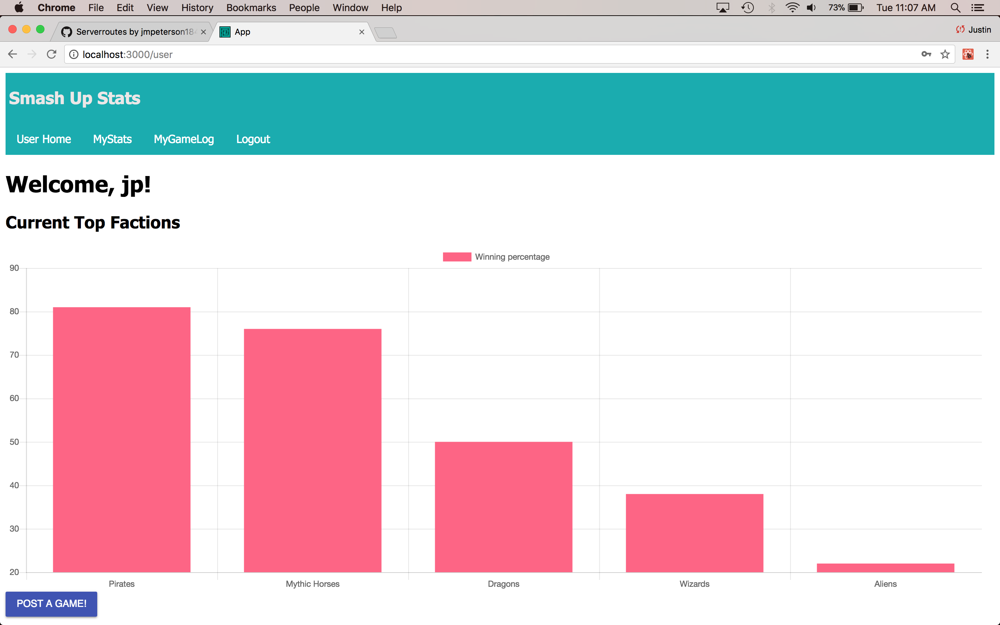

# Background
My friends and I are obsessed with the shuffle-building card game called Smash Up.  A shuffle building card game means that the game only consists of decks of cards; each player selects two decks, shuffles them together, and then uses that shuffled deck to play the game.  Each deck of cards is called a faction; a faction is nothing more than a category of characters.  For example, there is a ninja faction which means all of the cards in that deck has everything to do with ninjas.  

The first person to get 15 points wins.  The way you get points is by conquering bases; each base has a given point value.  

## Purpose
There are three reasons why I created this app: 

- To determine which faction is the best
- To have a way to keep track of the stats of games in an organized and neat fastion
- To provide a way for others to input stats from their games

## Homepage
After logging in, the user will see the following graph:



## Download (Don't Clone) This Repository

* Don't Fork or Clone. Instead, click the `Clone or Download` button and select `Download Zip`.
* Unzip the project and start with the code in that folder.
* Create a new GitHub project and push this code to the new repository.

## Development Setup Instructions

* Run `npm install`
* Create a `.env` file at the root of the project and paste this line into the file:
    ```
    SERVER_SESSION_SECRET=superDuperSecret
    ```
    While you're in your new `.env` file, take the time to replace `superDuperSecret` with some long random string like `25POUbVtx6RKVNWszd9ERB9Bb6` to keep your application secure. Here's a site that can help you: [https://passwordsgenerator.net/](https://passwordsgenerator.net/). If you don't do this step, create a secret with less than eight characters, or leave it as `superDuperSecret`, you will get a warning.
* Start postgres if not running already by using `brew services start postgresql`
* Run `npm run dev`
* Navigate to `localhost:3000`

## Debugging

To debug, you will need to run the client-side separately from the server. Start the client by running the command `npm run dev:client`. Start the debugging server by selecting the Debug button.


Then make sure `Launch Program` is selected from the dropdown, then click the green play arrow.


## Linting

The Airbnb ESLint for react is a part of this project. If you would like to take advantage of this in VS Code, you can add the `ESLint` extension. Click the `Extensions` button (the button right below the `Debug`) and search for `ESLint`. Click `install` for the first result and then click `Reload`. Then it should be all set up!


## Production Build

This is the build Heroku will run, but during development, you will likely not need to use it.

* Start postgres if not running already by using `brew services start postgresql`
* Run `npm start`
* Navigate to `localhost:5000`

## Lay of the Land

* `src/` contains the React application
* `public/` contains static assets for the client-side
* `build/` after you build the project, contains the transpiled code from `src/` and `public/` that will be viewed on the production site
* `server/` contains the Express App

## Deployment

1. Create a new Heroku project
1. Link the Heroku project to the project GitHub Repo
1. Create an Herkoku Postgres database
1. Connect to the Heroku Postgres database from Postico
1. Create the necessary tables
1. Add an environment variable for `SERVER_SESSION_SECRET` with a nice random string for security
1. In the deploy section, select manual deploy
