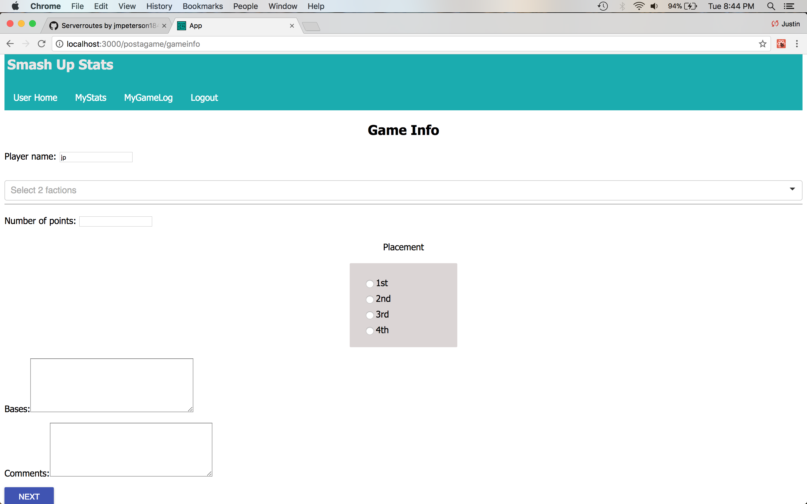
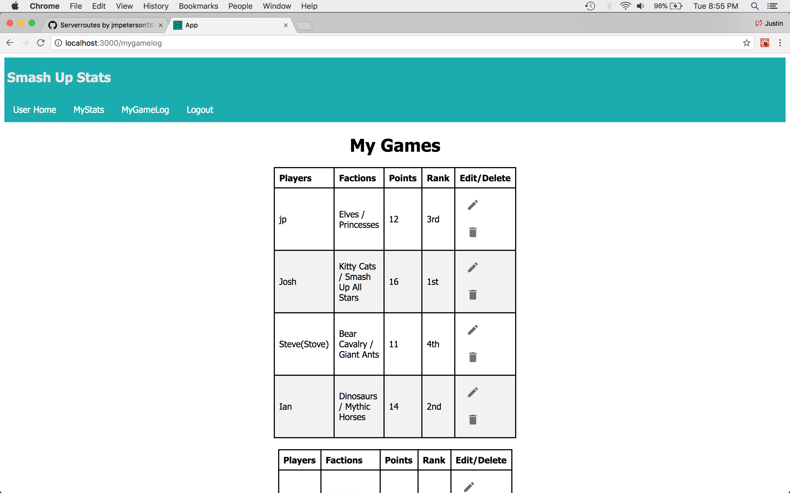

# Background
My friends and I are obsessed with the shuffle-building card game called Smash Up.  A shuffle building card game means that the game only consists of decks of cards; each player selects two decks, shuffles them together, and then uses that shuffled deck to play the game.  Each deck of cards is called a faction; a faction is nothing more than a category of characters.  For example, there is a ninja faction which means all of the cards in that deck has everything to do with ninjas.  

The first person to get 15 points wins.  The way you get points is by conquering bases; each base has a given point value.  

## Purpose
There are three reasons why I created this app: 

- To determine which faction is the best
- To have a way to keep track of the stats of games in an organized and neat fastion
- To provide a way for others to input stats from their games

## Homepage
After logging in, the user will see the following graph:

This graph displays the top five factions based on their winning percentage of every game entered by every user.  The reason for basing it off of winning percentage is because the makers of Smash Up create new factions each year; if the top factions were based on number of wins, the older factions would have an unfair advantage over the newer factions.

## Post A Game!
In order for a user to record a game, he or she will click on the Post A Game! button on the bottom of any view.  After selecting the number of players, the following screen will be displayed: 

After recording the user's information, the user will click the next button and input the other players' information.

## MyGameLog
Once a game has been submitted, the user will be taken to the MyGameLog page.  Here the user can see all of the games he or she has inputted.  If there is a mistake in one of the entries, the user can edit a game by click on the pencil icon.  If the user wants to delete a game, he or she can click on the garabage icon

